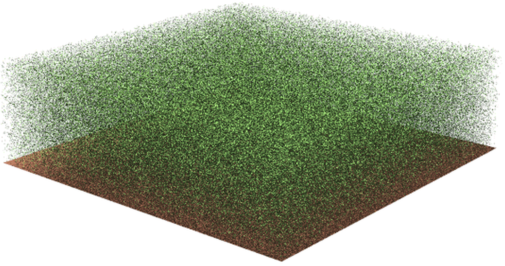

# __prospect__ 

# An R package for the simulation of leaf optical properties based on their biochemical and biophysical properties using the PROSPECT leaf model. 

[](https://www.r-project.org/Licenses/GPL-3)
[]

# 1 Install

After installing package `devtools`, the package `prospect` can be installed with the following command line in R session:
```
devtools::install_gitlab('jbferet/prospect')
```
# 2 Tutorial

<!-- README.md is generated from README.Rmd. Please edit that file -->

<!-- ```{r include = FALSE} -->
<!-- knitr::opts_chunk$set( -->
<!--   collapse = TRUE, -->
<!--   comment = "#>", -->
<!--   fig.path = "man/figures/README-", -->
<!--   out.width = "100%" -->
<!-- ) -->
<!-- ``` -->

A tutorial vignette is available [here](https://jbferet.gitlab.io/prospect/articles/prospect.html).

# 3 Citation

If you use **prospect**, please cite the following references:

Féret, J.-B., Berger, K., de Boissieu, F. & Malenovský 2020. Estimation of leaf protein and carbon-based constituent content from optical properties with the PROSPECT-PRO model. Remote Sensing of Environment.

Féret, J.-B., Gitelson, A.A., Noble, S.D. & Jacquemoud, S. 2017. PROSPECT-D: Towards modeling leaf optical properties through a complete lifecycle. Remote Sensing of Environment. 193, 204–215. http://dx.doi.org/10.1016/j.rse.2017.03.004
