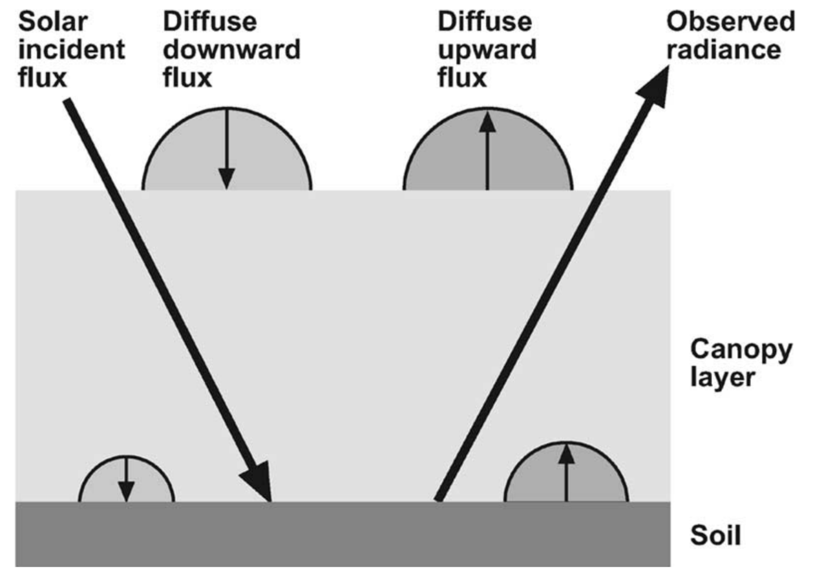

```{r setup, include = FALSE}
knitr::opts_chunk$set(
  collapse = TRUE,
  comment = "#>",
  eval=FALSE
)
```


This tutorial briefly describes the different functionalities of the R package `prosail`, based on the canopy reflectance model __4SAIL__ coupled with the leaf model __PROSPECT__.
The package `prosail` includes the package `prospect`, so please check the brief tutorial from [this package](https://jbferet.gitlab.io/prospect/) if you need specific information on __PROSPECT__.

The current version of the model PROSPECT implemented in `prosail` is __PROSPECT-PRO__.

The current version of the model SAIL implemented in `prosail` is __4SAIL__. 

The SAIL model is an example of four-stream representations of the radiative transfer equation, in which case one distinguishes two direct fluxes (incident solar flux and radiance in the viewing direction) and two diffuse fluxes (upward and downward hemispherical flux). Detailed description of the functioning of SAIL can be found in [Verhoef et al., 2007](https://doi.org/10.1109/TGRS.2007.895844), from which th figure below is taken.

<center>
  
</center> 
<center>
  Fig. 1. Four-stream RT modeling concept as applied in SAIL model
</center> 


# Running `prosail` in direct mode

## Input variables
The function `PRO4SAIL` runs PROSAIL for individual canopy reflectances and expects the following input variables.

* `SpecPROSPECT`: dataframe including the refractive index and specific absorption ceofficients, defined for a given spectral range (max range: 400 nm - 2500 nm). Simulation and inversion on different spectral domains can be peformed by adapting the information in `SpecPROSPECT`

* The biochemical and biophysical input variables of PROSPECT, including `N`, `CHL`, `CAR`, `ANT`, `BROWN`, `EWT`, `LMA`, `PROT`, `CBC`, `alpha`. If no value, their default value is set

* `TypeLidf`: two leaf inclination distribution functions are implemented here. 

    * Define `TypeLidf=1` if you want to use the original LIDF introduced by [Verhoef (1998)](https://edepot.wur.nl/210943).
        * if `TypeLidf=1` then `LIDFa` controls the average leaf slope and `LIDFb` controls the distribution's bimodality
    * Define `TypeLidf=2` if you want to use the [ellipsoidal distribution function](https://www.sciencedirect.com/science/article/pii/0168192386900109) characterised by the average leaf inclination angle in degree
        * if `TypeLidf=2` then `LIDFa` controls the average leaf angle

* `lai`: leaf area angle

* `q`: hot spot parameter

* `tts`: sun zenith angle (0 degres = sun at the vertical of surface)

* `tto`: observer zenith angle (0 degres = nadir observation)

* `psi`: azimuth between sun and observer (in degrees)

* `rsoil`: soil reflectance

## Output variables
`PRO4SAIL` returns a list containing four reflectance factors 

* `rddt`: bi-hemispherical reflectance factor
* `rsdt`: directional-hemispherical reflectance factor for solar incident flux
*	`rdot`: hemispherical-directional reflectance factor in viewing direction
* `rsot`: bi-directional reflectance factor


```{r prosail direct mode}
library(prosail)

# define input variables for PROSPECT. 
# refer to prospect tutorial for default values corresponding to undefined PROSPECT variables
CHL <- 40; CAR <- 8; ANT <- 0.0; EWT <- 0.01; LMA <- 0.009; N = 1.5;

# define input variables for SAIL. 
lai <- 5;       # LAI
q <- 0.01;      # Hot spot parameter
TypeLidf <- 2;  LIDFa <- 30;    LIDFb <- NULL;  # leaf inclination distribution function parameters
tts <- 30;      tto <- 10;      psi <- 90;      # geometry of acquisition
rsoil <- SpecSOIL$Dry_Soil                      # soil reflectance (SpecSOIL includes Dry_Soil and Wet_Soil properties)
# run PROSAIL
Ref <- PRO4SAIL(SpecPROSPECT,CHL = CHL, CAR = CAR, ANT = ANT, EWT = EWT, LMA = LMA, N = N,
               TypeLidf = TypeLidf,LIDFa = LIDFa,LIDFb = LIDFb,lai = lai,
               q = q,tts = tts,tto = tto,psi = psi,rsoil = rsoil)
```


# Computing a simplified bidirectional reflectance factor under the assumption of clear conditions conditions

The function `Compute_BRF` computes the bi-directional reflectance factor in the direction of the observer, by combining both hemispherical-diretcional and bi-directional reflectance factors.
The direct and diffuse light are taken into account as proposed by [Francois et al. (2002)](https://doi.org/10.1051/agro:2002033), by computing the share of diffuse flux in global radiation `skyl` based on the equation proposed by [Spitters et al., 1986](https://www.sciencedirect.com/science/article/pii/0168192386900602).

```{r compute BRF}
# Ref is the variable obtained when running PRO4SAIL as in the previous illustration
# SpecATM corresponds to the direct and diffuse radiation solar spectra
BRF <-Compute_BRF(Ref$rdot,Ref$rsot,tts,SpecATM)
```

# Simulating sensor BRF

The simulation of sensor BRF requires the Spectral Response Function (SRF) of the sensor. 
`prosail` includes the SRF of [Sentinel-2A and Sentinel-2B satellites](https://earth.esa.int/documents/247904/685211/S2-SRF_COPE-GSEG-EOPG-TN-15-0007_3.0.xlsx).

Other stellites can be simulated as long as the SRF is provided as CSV file, following the same template as for the SRF of Sentinel-2 satellites. 

```{r SRF 1}
# get the spectral response for Sentinel-2A
SensorName = 'Sentinel_2A'
# if interested in a different satellite, please use Path_SensorResponse to locate the SRF file expected to be named 'SensorName_Spectral_Response.csv' (separator = tabulations)
SRF <- GetRadiometry(SensorName,Path_SensorResponse = NULL)
```

SRF can also be directly computed for any sensor under the hypothesis of normal response for each spectral band, and information about the central wavelength and FWHM corresponding to each spectral band

```{r SRF 2}
# WL is a vector giving central wavelength for each band in nanometer
# FWHM is a vector giving FWHM for each band in nanometer
SRF = Compute_SRF(WL,FWHM)
```

Then, optical values used to compute reflectance (specifica absorption constituents, soil properties, direct/diffuse radiation) can be converted at solar resolution before simulation of reflectance:

```{r Conversion}
# apply sensor characteristics to PROSPECT optical constants
SpecPROSPECT_Sensor = applySensorCharacteristics(wvl,SpecPROSPECT,SRF)
SpecPROSPECT_Sensor = split(SpecPROSPECT_Sensor, rep(1:ncol(SpecPROSPECT_Sensor), each = nrow(SpecPROSPECT_Sensor))) # split matrix into list
names(SpecPROSPECT_Sensor)=names(SpecPROSPECT) # keep names for elements of list
# apply sensor characteristics to atmospheric properties
SpecATM_Sensor = applySensorCharacteristics(wvl,SpecATM,SRF)
SpecATM_Sensor = split(SpecATM_Sensor, rep(1:ncol(SpecATM_Sensor), each = nrow(SpecATM_Sensor))) # split matrix into list
names(SpecATM_Sensor)=names(SpecATM) # keep names for elements of list
# apply sensor characteristics to soil properties
SpecSOIL_Sensor = applySensorCharacteristics(wvl,SpecSOIL,SRF)
SpecSOIL_Sensor = split(SpecSOIL_Sensor, rep(1:ncol(SpecSOIL_Sensor), each = nrow(SpecSOIL_Sensor))) # split matrix into list
names(SpecSOIL_Sensor)=names(SpecSOIL) # keep names for elements of list
```


... and BRF can be computed based on these values

```{r BRF new res}
# WL is a vector giving central wavelength for each band in nanometer
# FWHM is a vector giving FWHM for each band in nanometer
rsoil2 <- SpecSOIL_Sensor$Dry_Soil
Ref_Sensor <- PRO4SAIL(SpecPROSPECT_Sensor,CHL = CHL, CAR = CAR, ANT = ANT, EWT = EWT, LMA = LMA, N = N,
               TypeLidf = TypeLidf,LIDFa = LIDFa,LIDFb = LIDFb,lai = lai,
               q = q,tts = tts,tto = tto,psi = psi,rsoil = rsoil)
# Computes bidirectional reflectance factor based on outputs from PROSAIL and sun position
BRF_Sensor <-Compute_BRF(Ref_Sensor$rdot,Ref_Sensor$rsot,tts,SpecATM_Sensor)
```

