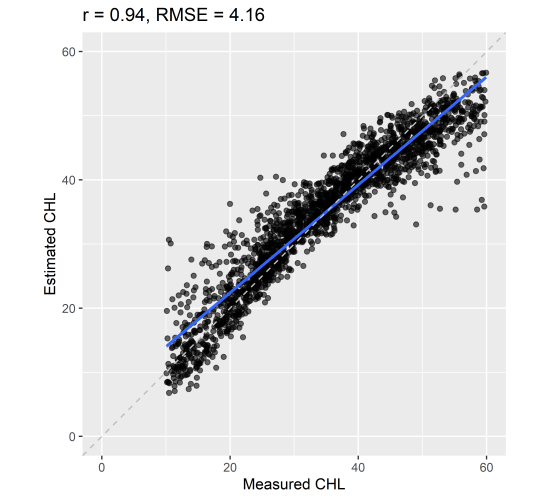
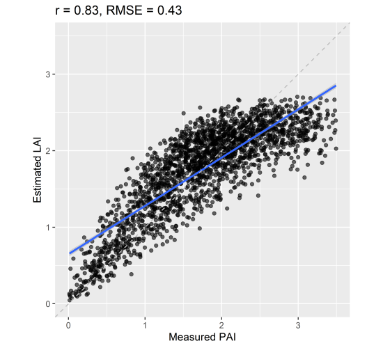
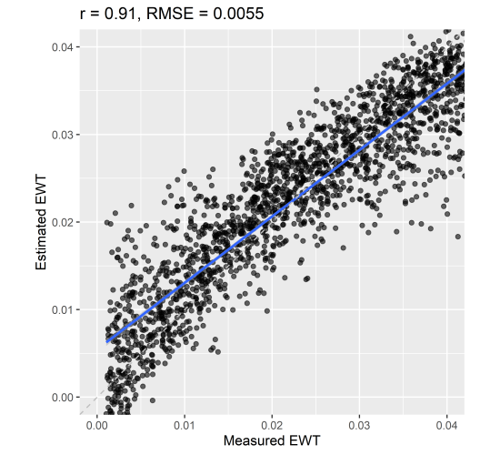
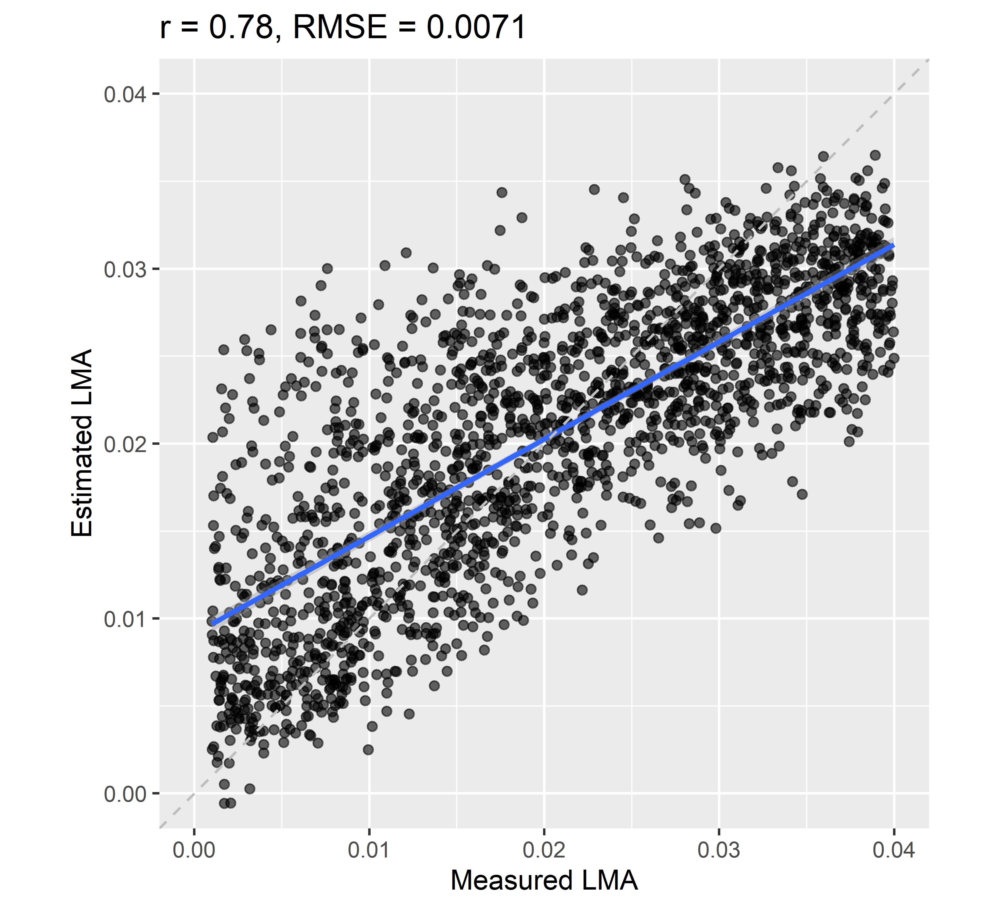

```{r setup, include = FALSE}
knitr::opts_chunk$set(
  collapse = TRUE,
  comment = "#>",
  eval=FALSE
)
```


This tutorial describes how to run a hybrid inversion using the package `prosail`.

Currently, the default hybrid inversion implemented in  `prosail` is built around __4SAIL__ and support vector regression (SVR) as machine learning algorithm. It is also possible to use __4SAIL2__ as alternative version. 

This hybrid inversion consists in bagging prediction of biophysical properties: a LUT is simulated with PROSAIL and resampled in order to produce multiple datasets including a limited number of samples. Then a set of individual SVR models is trained from each reduced dataset. The following example illustrates how to proceed to train and apply this inversion. 

# Definition of sensor characteristics

```{r define_sensor}
library(prosail)
# Define output directory
Path.Results <- 'Hybrid_Inversion'
dir.create(Path.Results,showWarnings = FALSE)
# Define S2 Spectral Response Function based on ESA specifications
SensorName <- 'Sentinel_2'
SRF <- GetRadiometry(SensorName,Path_SensorResponse = NULL)
# convert 1nm reflectance into Sentinel-2 reflectance
# adjust optical constants
SpecSensor <- PrepareSensorSimulation(SpecPROSPECT,SpecSOIL,SpecATM,SRF)
SpecPROSPECT_Sensor <- SpecSensor$SpecPROSPECT_Sensor
SpecSOIL_Sensor <- SpecSensor$SpecSOIL_Sensor
SpecATM_Sensor <- SpecSensor$SpecATM_Sensor
```


# Prepare distribution of input PROSAIL parameters used to generate a training LUT

```{r prepare_LUT_InputParms}
# Define distribution for PROSAIL input variables: choose between 'Gaussian' and 'Uniform'
TypeDistrib <- data.frame('CHL'='Gaussian', 'CAR'='Uniform','EWT' = 'Uniform','ANT' = 'Uniform',
                          'LMA' = 'Uniform','N' = 'Uniform', 'BROWN'='Uniform',
                          'psoil' = 'Uniform','LIDFa' = 'Uniform', 'lai' = 'Gaussian',
                          'q'='Uniform','tto' = 'Uniform','tts' = 'Uniform', 'psi' = 'Uniform')

# define mean and STD for gaussian distributions
Mean <- data.frame('CHL'=35,'CAR'=8,'lai' = 1.75)
Std <- Mean/2.0

# define min and max values for all parameters defined in TypeDistrib
minval <- data.frame('CHL'=10,'CAR'=0,'EWT' = 0.001,'ANT' = 0,'LMA' = 0.001,'N' = 1.4, 'BROWN'=0.01,
                     'psoil' = 0.0, 'LIDFa' = 30, 'lai' = 0.01,'q'=0.01,'tto' = 0,'tts' = 20, 'psi' = 100)
maxval <- data.frame('CHL'=60,'CAR'=15,'EWT' = 0.045,'ANT' = 10,'LMA' = 0.040,'N' = 1.7, 'BROWN'=0.01,
                     'psoil' = 1.0, 'LIDFa' = 70, 'lai' = 3.5,'q'=0.01,'tto' = 5,'tts' = 30, 'psi' = 150)

# define parameters to be set to unique value
# ... other undefined parameters wil be set to default automatically 
ParmSet <- data.frame('TypeLidf' = 2, 'alpha' = 40)

# define number of samples to be simulated in the LUT
nbSamples <- 2000
# get random distribution based on previously defined parameters
InputPROSAIL <- get_distribution_input_prosail(minval = minval, maxval = maxval, 
                                               ParmSet = ParmSet ,nbSamples = nbSamples,
                                               TypeDistrib = TypeDistrib, Mean = Mean, Std = Std)
```


# Simulation of BRF following user-defined distribution

The simulation of sensor reflectance is usually performed in two steps: 
- simulation of reflectance with 1 nm spectral sampling
- conversion from 1 nm sampling to sensor spectral sampling using the proper spectral response function

```{r simulate_LUT}
# produce 1 nm BRF LUT based on InputPROSAIL
BRF_LUT_1nm <- Generate_LUT_BRF(InputPROSAIL = InputPROSAIL, SpecPROSPECT = SpecPROSPECT,
                                BandNames = SpecPROSPECT$lambda, SpecSOIL = SpecSOIL,
                                SpecATM = SpecATM, SAILversion = '4SAIL')

# convert to sensor spectral characteristics
wvl <- SpecPROSPECT$lambda
BRF_LUT <- applySensorCharacteristics(wvl = wvl,
                                      SRF = SRF,
                                      InRefl = BRF_LUT_1nm)
```

# Simulation of BRF using sensor spectral response function

The `prosail` package does not include an exhaustive soil database. 
Therefore, it may be possible that soil optical properties corresponding to a scene in an optical image do not correspond to the default dry and wet soil reflectance defined as default soil properties.
In such case, users can define soil properties based on pixels corresponding bare soil and picked in the image, assuming that these exist.
The soil optical properties will then already have sensor spectral response. 
In this case, if users want to define custom soil properties, they need to apply sensor response function to all optical constants used in PROSAIL.

```{r simulate_LUT_Alternative}
# apply sensor characteristics to PROSPECT optical constants
wvl <- SpecPROSPECT$lambda
Spec_Sensor <- applySensorCharacteristics(wvl,SpecPROSPECT,SRF)
Spec_Sensor <- split(Spec_Sensor, rep(1:ncol(Spec_Sensor), each = nrow(Spec_Sensor))) # split matrix into list
names(Spec_Sensor) <- names(SpecPROSPECT) # keep names for elements of list
# apply sensor characteristics to atmospheric properties
SpecATM_Sensor <- applySensorCharacteristics(wvl,SpecATM,SRF)
SpecATM_Sensor <- split(SpecATM_Sensor, rep(1:ncol(SpecATM_Sensor), each = nrow(SpecATM_Sensor))) # split matrix into list
names(SpecATM_Sensor) <- names(SpecATM) # keep names for elements of list
# apply sensor characteristics to soil properties
SpecSOIL_Sensor <- applySensorCharacteristics(wvl,SpecSOIL,SRF)
SpecSOIL_Sensor <- split(SpecSOIL_Sensor, rep(1:ncol(SpecSOIL_Sensor), each = nrow(SpecSOIL_Sensor))) # split matrix into list
names(SpecSOIL_Sensor) <- names(SpecSOIL) # keep names for elements of list
```

This conversion can also be done using a unique function `PrepareSensorSimulation`: 

```{r conversion_SRF_OptCst}
# apply sensor characteristics to PROSPECT optical constants
PropSensor <- PrepareSensorSimulation(SpecPROSPECT,SpecSOIL,SpecATM,SRF)
Spec_Sensor <- PropSensor$SpecPROSPECT_Sensor
SpecSOIL_Sensor <- PropSensor$SpecSOIL_Sensor
SpecATM_Sensor <- PropSensor$SpecATM_Sensor
```

... Then BRF can be computed based on these values:

```{r Apply_SRF_Reflectance}
# WL is a vector giving central wavelength for each band in nanometer
# FWHM is a vector giving FWHM for each band in nanometer
rsoil <- SpecSOIL_Sensor$Dry_Soil
Ref_Sensor <- PRO4SAIL(Spec_Sensor = Spec_Sensor,CHL = CHL, CAR = CAR, ANT = ANT, EWT = EWT, LMA = LMA, N = N,
                       TypeLidf = TypeLidf,LIDFa = LIDFa,LIDFb = LIDFb,
                       lai = lai,q = q,tts = tts,tto = tto,psi = psi,rsoil = rsoil)
# Computes bidirectional reflectance factor based on outputs from PROSAIL and sun position
BRF_Sensor <- Compute_BRF(Ref_Sensor$rdot,Ref_Sensor$rsot,tts,SpecATM_Sensor)
```

# Biophysical variables of interest 
Definition of the biophysical variables of interest using hybrid inversion.

```{r define_biophysical_props}
Parms2Estimate <- c('CHL','EWT','LMA','lai')
```

# Refine spectral properties
The reflectance data used for inversion needs application of gaussian noise in order to improve applicability on experimental data. 
Specific spectral bands may also be defined for each biophysical variable of interest. 

```{r refine_spectral}
# Define spectral bands of interest for each biophysical variable
Bands2Select <- list()
Bands2Select$CHL <- c(2,3,4,5,6,7,8,9,10)
Bands2Select$EWT <- c(2,3,4,5,6,7,8,9,10)
Bands2Select$LMA <- c(2,3,4,5,6,7,8,9,10)
Bands2Select$lai <- c(2,3,4,5,6,7,8,9,10)

# Define gaussian noise to be applied on reflectance
NoiseLevel <- list()
NoiseLevel$CHL <- 0.01
NoiseLevel$EWT <- 0.01
NoiseLevel$LMA <- 0.01
NoiseLevel$lai <- 0.05

# Apply gaussian noise to be applied on reflectance
BRF_LUT_Noise   = list()
for (parm in Parms2Estimate){
  BRF_LUT_Noise[[parm]] <- Apply_Noise_LUT(BRF_LUT[Bands2Select[[parm]],],NoiseLevel[[parm]],NoiseType = 'relative')
}
```


# Train hybrid inversion

Train a set of SVR models for each variable with the function `PROSAIL_Hybrid_Train`.

```{r Train_Hybrid}
modelSVR <- list()
# define algorighm 
method <- 'liquidSVM'
# bagging with replacement for each subset
Replacement <- FALSE
# number of samples used for training of each submodel
nbSamplesPerRun <- 100
nbEnsemble <- round(nbSamples/nbSamplesPerRun)
# for each parameter to estimate
for (parm in Parms2Estimate){
  InputVar <- InputPROSAIL[[parm]]
  modelSVR[[parm]] <- PROSAIL_Hybrid_Train(BRF_LUT = BRF_LUT_Noise[[parm]],InputVar = InputVar,
                                           FigPlot = FALSE, nbEnsemble = nbEnsemble,
                                           WithReplacement = Replacement, method = method)
}
```

The default machine learning algorithm is support vector regression from the package `liquidSVM`. However, multiple users experienced difficulties installing this package. Therefore, an alternative SVR implementation based on the package `caret` is also implemented.

Set `method <- 'svmLinear'` or `method <- 'svmRadial'` to choose between the alternative implementations. 

# Apply hybrid inversion

Apply the set of SVR models on a dataset for each variable with the function `PROSAIL_Hybrid_Apply`.

```{r Apply_Hybrid}
###########################################################
# perform prediction based on models in previous steps
# the prediction returns mean value obtained form the ensemble of regression models for each sample, 
# as well as corresponding standard deviation
MeanEstimate <- StdEstimate <- list()
for (parm in Parms2Estimate){
  HybridRes <- PROSAIL_Hybrid_Apply(modelSVR[[parm]],BRF_LUT_Noise[[parm]])
  MeanEstimate[[parm]] <- HybridRes$MeanEstimate
  StdEstimate[[parm]] <- HybridRes$StdEstimate
}
```

# Plot results

Plot the results obtained when applying the regression models on training data. 

__(!!! Only for illustration. Always use independent dataset to assess performance of your model !!!).__

```{r Plot_Results}
# put all field observations and results in a dataframe
Results <- data.frame('CABMES' = InputPROSAIL$CHL,'CABMOD' = MeanEstimate$CHL,'CABStd' = StdEstimate$CHL,
                      'EWTMES' = InputPROSAIL$EWT,'EWTMOD' = MeanEstimate$EWT,'EWTStd' = StdEstimate$EWT,
                      'LMAMES' = InputPROSAIL$LMA,'LMAMOD' = MeanEstimate$LMA,'LMAStd' = StdEstimate$LMA,
                      'LAIMES' = InputPROSAIL$lai,'LAIMOD' = MeanEstimate$lai,'LAIStd' = StdEstimate$lai)

# filename = file.path(Path.Results,'Experimental_Datapoints.txt')
# write.table(x = Results,file = filename,append = F, quote = F,
#             row.names = F,sep = '\t')


###########################################################
# plot resulting estimated values
library(ggplot2)
library(ggpmisc)
library(ggpubr)
library(pracma)

# plot LAI
statsReg1 <- cor.test(Results$LAIMES, Results$LAIMOD)$estimate
statsReg2 <- rmserr(Results$LAIMES, Results$LAIMOD)$rmse
statsReg <- paste0("r = ", round(statsReg1,2), ", RMSE = ", round(statsReg2,2))

ggplot(data = Results, aes(x=LAIMES, y=LAIMOD)) +
  geom_point(alpha=0.6) +
  geom_smooth(method=lm, aes(group = 1)) +
  coord_fixed(ratio = 1,xlim = c(0.0,3.5), ylim = c(-0.0,3.5)) +
  geom_abline(intercept = 0, slope = 1,linetype="dashed", size=0.5,color='gray')+
  ggtitle(statsReg) +
  xlab("Measured PAI") +
  ylab("Estimated LAI")
filename = file.path(Path.Results,'LAI.png')
ggsave(filename, plot = last_plot(), device = 'png', path = NULL,
       scale = 1, width = 5.5, height = 5, units = "in",
       dpi = 600, limitsize = TRUE)

# plot CAB
statsReg1 <- cor.test(Results$CABMES, Results$CABMOD)$estimate
statsReg2 <- rmserr(Results$CABMES, Results$CABMOD)$rmse
statsReg <- paste0("r = ", round(statsReg1,2), ", RMSE = ", round(statsReg2,2))
ggplot(data = Results, aes(x=CABMES, y=CABMOD)) +
  geom_point(alpha=0.6) +
  geom_smooth(method=lm, aes(group = 1)) +
  coord_fixed(ratio = 1,xlim = c(0,60), ylim = c(0,60)) +
  geom_abline(intercept = 0, slope = 1,linetype="dashed", size=0.5,color='gray')+
  ggtitle(statsReg) +
  xlab("Measured CHL") +
  ylab("Estimated CHL")
filename = file.path(Path.Results,'CHL.png')
ggsave(filename, plot = last_plot(), device = 'png', path = NULL,
       scale = 1, width = 5.5, height = 5, units = "in",
       dpi = 600, limitsize = TRUE)

# plot EWT
statsReg1 = cor.test(Results$EWTMES, Results$EWTMOD)$estimate
statsReg2 = rmserr(Results$EWTMES, Results$EWTMOD)$rmse
statsReg = paste0("r = ", round(statsReg1,2), ", RMSE = ", round(statsReg2,4))

ggplot(data = Results, aes(x=EWTMES, y=EWTMOD)) +
  geom_point(alpha=0.6) +
  geom_smooth(method=lm, aes(group = 1)) +
  coord_fixed(ratio = 1,xlim = c(0,0.04), ylim = c(0,0.04)) +
  geom_abline(intercept = 0, slope = 1,linetype="dashed", size=0.5,color='gray')+
  ggtitle(statsReg) +
  xlab("Measured EWT") +
  ylab("Estimated EWT")
filename = file.path(Path.Results,'EWT.png')
ggsave(filename, plot = last_plot(), device = 'png', path = NULL,
       scale = 1, width = 5.5, height = 5, units = "in",
       dpi = 600, limitsize = TRUE)


# plot LMA
statsReg1 = cor.test(Results$LMAMES, Results$LMAMOD)$estimate
statsReg2 = rmserr(Results$LMAMES, Results$LMAMOD)$rmse
statsReg = paste0("r = ", round(statsReg1,2), ", RMSE = ", round(statsReg2,4))

ggplot(data = Results, aes(x=LMAMES, y=LMAMOD)) +
  geom_point(alpha=0.6) +
  geom_smooth(method=lm, aes(group = 1)) +
  coord_fixed(ratio = 1,xlim = c(0,0.04), ylim = c(0,0.04)) +
  geom_abline(intercept = 0, slope = 1,linetype="dashed", size=0.5,color='gray')+
  ggtitle(statsReg) +
  xlab("Measured LMA") +
  ylab("Estimated LMA")
filename = file.path(Path.Results,'LMA.png')
ggsave(filename, plot = last_plot(), device = 'png', path = NULL,
       scale = 1, width = 5.5, height = 5, units = "in",
       dpi = 600, limitsize = TRUE)


```

The resulting estimated values are displayed: 


<p float="left">
  
  
</p>
<p float="left">
  
  
</p>
<center>
  Fig. 1. Estimation of `CHL`, `LAI`, `EWT` and `LMA` from a simulated dataset corresponding to Sentinel-2 BRF using PROSAIL-D Hybrid inversion based on bagged SVR.
</center> 
<p>&nbsp;</p>
