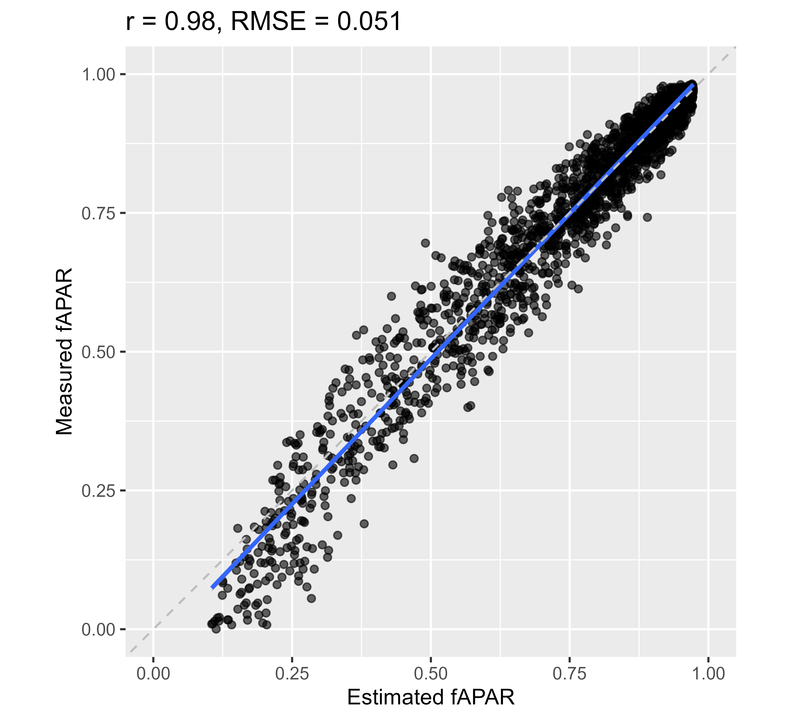
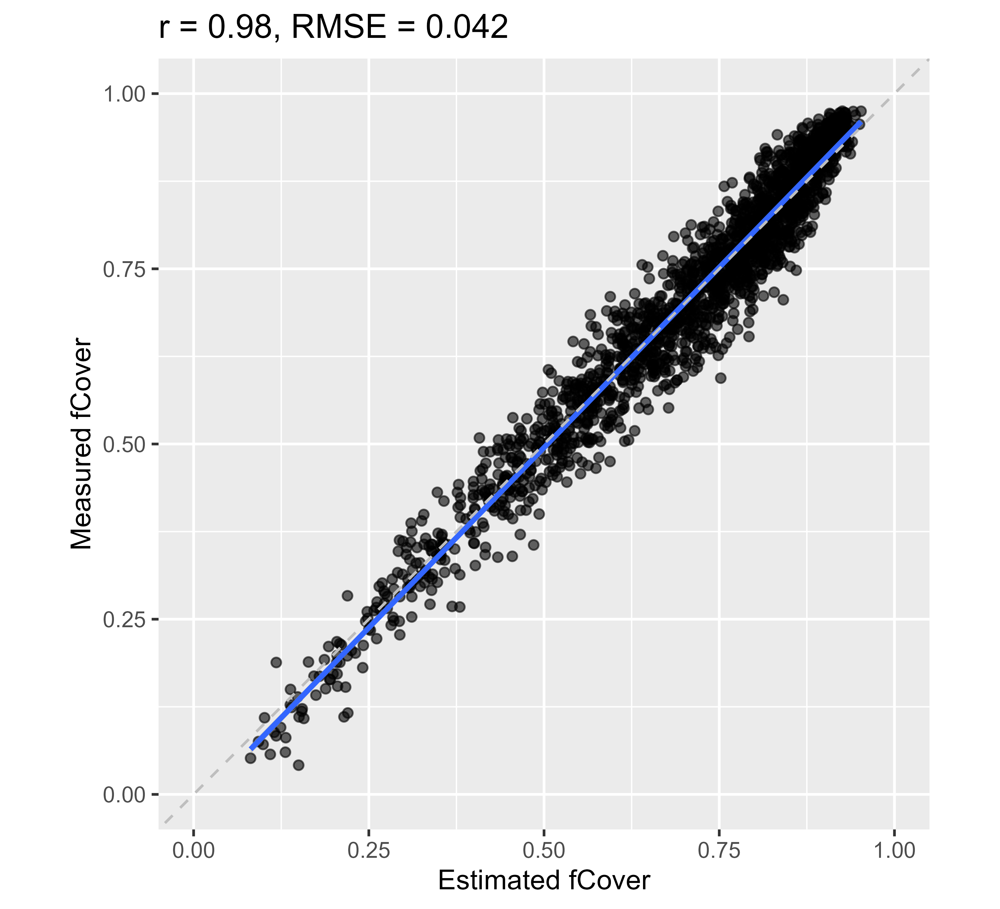

```{r setup, include = FALSE}
knitr::opts_chunk$set(
  collapse = TRUE,
  comment = "#>",
  eval=FALSE
)
```


This tutorial describes how to run a hybrid inversion with `prosail`. 
This hybrid inversion consists in bagging prediction of biophysical properties: 
a LUT is simulated with PROSAIL and resampled in order to produce multiple 
datasets including a limited number of samples. Then a set of individual support 
vector regression (SVR) models is trained from each reduced dataset. 

The hybrid inversion consists in two main stages for users: 

- training of a machine learning regression model (SVR) for each biophysical 
property of interest based on a bi-directional reflectance factor (BRF) LUT 
simulated with PROSAIL

- application of the SVR models to a dataset provided as a matrix or as a raster

This hybrid inversion can be easily parameterized to adapt to any type of sensor, 
input parameter distribution, type of noise. 
However, for the sake of straightforwardness, the parameterization defined in 
the [Algorithm Theoretical Based Document](http://step.esa.int/docs/extra/ATBD_S2ToolBox_V2.1.pdf) 
(ATBD) of the Sentinel-2 toolbox can be applied on Sentinel-2 data.

The general workflow is described in Figure 1, and will be described in details 
in the following tutorials.

<p float="center">
  
</p>
<center>
  Fig. 1. Workflow of PROSAIL hybrid inversion implemented in the package `prosail`.
</center> 

The default hybrid inversion implemented in  `prosail` is built around __4SAIL__ 
and support vector regression (SVR) as machine learning algorithm.
Hybrid inversion based on __4SAIL2__ simulations can be performed as well. 
However, this requires users to define their own  `InputPROSAIL` and `BRF_LUT` 
variables. 


# Define input PROSAIL parameters for the simulation of a training LUT

The production of a BRF LUT requires a variable `InputPROSAIL` as input. 
When running  __4SAIL__, the expected list of parameters includes: 
`lai`, `LIDFa`, `q`, `N`, `CHL`, `LMA`, `Cw_rel`, `BROWN`, `psoil`, `EWT`, 
`CBC`, `PROT`,  `ANT`, `CAR`, `tts`, `tto`, `psi`, `TypeLidf` and `alpha` 
(note that `TypeLidf` and `alpha` are usually set to their default value, 
`TypeLidf = 2` and `alpha = 40`).

There are currently three ways to define `InputPROSAIL`. 
The function `get_InputPROSAIL` allows generating `InputPROSAIL`:  

- when setting the parameter `atbd = TRUE`, `InputPROSAIL` is generated following 
the distribution and co-distribution described in the ATBD of the Sentinel-2 toolbox. 

- when setting min and max values for a list of parameters (`minval` and `maxval`) 
as well as the type of distribution for each parameter (`uniform` or `Gaussian`), 
`InputPROSAIL` is generated following these criteria. Gaussian distribution also 
requires definition of a list `GaussianDistrib` including `Mean` and `Std` for 
each input parameter when relevant.

Finally, users can define their own `InputPROSAIL` values based on the distribution 
and co-distribution of their choice. When `InputPROSAIL` is provided as input, 
the options corresponding to the function `get_InputPROSAIL` are ignored. 


# Run PROSAIL inversion following distributions and co-distibutions from ATBD

## Produce simulated BRF LUT corresponding to `InputPROSAIL`

The BRF LUT is produced from `InputPROSAIL` with the function `Generate_LUT_BRF`.
This function is expecting the variables `SpecPROSPECT`, `SpecSOIL` and `SpecATM` 
to share the same spectral sampling. 
An error message will be displayed if this is not the case. 

The BRF LUT obtained then corresponds to spectral information covering the 
spectral domain from 400 nm to 2500 nm with 1 nm spectral samplingm unless these 
variables were modified by user. 
This can be the case when adjusting `SpecSOIL` based on soil reflectance 
extracted from an acquisition. 
In this case, `SpecPROSPECT` and `SpecATM` should be adjusted in order to match 
the sensor characteristics before `train_prosail_inversion` is called.


## Apply sensor spectral response function (SRF) to the BRF LUT

The R package `prosail` includes the SRF corresponding to multiple sensors, 
including : 
__Sentinel-2A__, __Sentinel-2B__, __Landsat 7__, __Landsat 8__, __Landsat 9__, 
__Venus__, __MODIS__, __Pleiades 1A__, __Pleiades 1B__ and __SPOT 6-7__.

The SRF of these sensors can then be obtained by calling the function 
`GetRadiometry` and providing the name of the sensor of interest as input 
variable `SensorName`.

Alternatively, SRF can be computed from `GetRadiometry` by defining a list 
`SpectralProps` including `wl` which corresponds to the central wavelength and 
`fwhm` which corresponds to the FWHM. 
In this case, the sensor bands are assumed to have a gaussian response.


## Add noise to the sensor BRF LUT

Accounting for noise is important when performing hybrid inversions: 
PROSAIL simulations correspond to theoretical reflectance based on multiple 
assumptions and approximations. 
Hence, machine learning algorithms trained with simulations without noise are 
usually prone to overfitting.

When working with Sentinel-2 data, the introduction of noise as defined in the 
ATBD can be performed with `apply_noise_atbd`. 
This corresponds to a combination of additive and multiplicative noise. 

Alternatively, multiplicative noise can be applied on BRF by setting a value 
between 0 and 1 for `NoiseLevel` and for each regression model (1 is a 
multiplicative noise corresponding to 100% of the reflectance value). 


## Train SVM regression

Once the input PROSAIL and corresponding sensor BRF LUT with added noise are 
produced, the SVM models can be trained. 

The following script illustrates how to produce SVM regression models for the 
estimation of LAI, CHL, EWT and LMA when using Sentinel-2 data. 


```{r train_prosail_inversion}
library(prosail)
# get sensor response for Sentinel-2
SensorName <- 'Sentinel_2'
SRF <- GetRadiometry(SensorName)

# define parameters to estimate
Parms2Estimate <- c('lai', 'CHL', 'EWT', 'LMA', 'fCover', 'fAPAR', 'albedo')

# define spectral bands required to train SVR model for each variable
Bands2Select <- list()
for (parm in Parms2Estimate){
  S2BandSelect <- c('B3','B4','B5','B6','B7','B8','B11','B12')
  Bands2Select[[parm]] <- match(S2BandSelect,SRF$Spectral_Bands)
}

# define output directory where LUTs will be saved
PROSAIL_ResPath <- 'HybridInversion'
dir.create(path = PROSAIL_ResPath, showWarnings = FALSE,recursive = TRUE)

# define ranges for geometry of acquisition
GeomAcq <- list()
GeomAcq$min <- data.frame('tto' = 0, 'tts' = 20, 'psi' = 0)
GeomAcq$max <- data.frame('tto' = 10, 'tts' = 30, 'psi' = 360)

# train model
modelSVR <- train_prosail_inversion(Parms2Estimate = Parms2Estimate,
                                    atbd = TRUE, GeomAcq = GeomAcq, 
                                    SRF = SRF, 
                                    Bands2Select = Bands2Select, 
                                    Path_Results = PROSAIL_ResPath)
```


This processing steps resulting from `train_prosail_inversion` can be broken 
down as follows: 

- produce InputPROSAIL
```{r generate_InputPROSAIL_atbd}
InputPROSAIL <- get_InputPROSAIL(atbd = TRUE, 
                                 GeomAcq = GeomAcq)

```

- produce BRF LUT
```{r Generate_BRF_LUT_atbd}
res <- Generate_LUT_PROSAIL(SAILversion = '4SAIL',
                            InputPROSAIL = InputPROSAIL,
                            SpecPROSPECT = prospect::SpecPROSPECT_FullRange,
                            SpecSOIL = SpecSOIL,
                            SpecATM = SpecATM)
BRF_LUT_1nm <- res$BRF
InputPROSAIL$fCover <- res$fCover
InputPROSAIL$fAPAR <- res$fAPAR
InputPROSAIL$albedo <- res$albedo
```


- Apply sensor SRF
```{r Apply_SRF_atbd}
BRF_LUT <- applySensorCharacteristics(wvl = prospect::SpecPROSPECT_FullRange$lambda, 
                                      SRF = SRF, 
                                      InRefl = BRF_LUT_1nm)
# identify spectral bands in LUT
rownames(BRF_LUT) <- SRF$Spectral_Bands
```

- Add noise in BRF
```{r Noise_atbd}
BRF_LUT_Noise <- list()
for (parm in Parms2Estimate) BRF_LUT_Noise[[parm]] <- apply_noise_atbd(BRF_LUT)
```

- Train SVM regression model
```{r Train_SVR}
modelSVR <- list()
for (parm in Parms2Estimate){
  modelSVR[[parm]] <- PROSAIL_Hybrid_Train(BRF_LUT = BRF_LUT_Noise[[parm]],
                                           InputVar = InputPROSAIL[[parm]])
}
```


## Apply hybrid inversion

Once the SVR models are produced from `PROSAIL_Hybrid_Train` or from 
`train_prosail_inversion`, they can be applied on a dataset for each variable 
with the function `PROSAIL_Hybrid_Apply`.

The following example applies the regression models to the simulated BRF produced 
during the training stage. 
This is of course not recommended, and used only for illustrative purpose.

```{r Apply_Hybrid_atbd}
###########################################################
# perform prediction based on models in previous steps
# the prediction returns mean value obtained form the ensemble of regression models for each sample, 
# as well as corresponding standard deviation
MeanEstimate <- StdEstimate <- list()
for (parm in Parms2Estimate){
  HybridRes <- PROSAIL_Hybrid_Apply(RegressionModels = modelSVR[[parm]],
                                    Refl = BRF_LUT_Noise[[parm]])
  MeanEstimate[[parm]] <- HybridRes$MeanEstimate
  StdEstimate[[parm]] <- HybridRes$StdEstimate
}
```


## Plot results

Plot the results obtained when applying the regression models on training data. 

__(!!! Only for illustration. Always use independent dataset to assess performance of your model !!!).__

```{r Plot_Results_ATBD}
###########################################################
# plot resulting estimated values
library(ggplot2)
library(ggpmisc)
library(ggpubr)
library(pracma)

# define min and max axis values for each parameter
xylim <- list('lai' = c(0.0,12), 'CHL' = c(20,90), 'EWT' = c(0.0,0.04), 
              'LMA' = c(0.003,0.011), 'fCover' = c(0,1), 'fAPAR' = c(0,1), 
              'albedo' = c(0,0.4))

for (parm in Parms2Estimate){
  # create dataframe and plot results
  Results <- data.frame('measured' = InputPROSAIL[[parm]], 
                        'estimated' = MeanEstimate[[parm]])
  statsReg1 <- cor.test(Results$measured, Results$estimated)$estimate
  statsReg2 <- rmserr(Results$measured, Results$estimated)$rmse
  statsReg <- paste0("r = ", round(statsReg1,2), ", RMSE = ", round(statsReg2,3))
  
  ggplot(data = Results, aes(x=estimated, y=measured)) +
    geom_point(alpha=0.6) +
    geom_smooth(method=lm, aes(group = 1)) +
    coord_fixed(ratio = 1,xlim = xylim[[parm]], ylim = xylim[[parm]]) +
    geom_abline(intercept = 0, slope = 1, linetype = "dashed", linewidth = 0.5, color='gray')+
    ggtitle(statsReg) +
    ylab(paste('Measured', parm)) +
    xlab(paste('Estimated', parm))
  filename <- file.path(PROSAIL_ResPath, paste(parm,'_atbd.png',sep = ''))
  ggsave(filename, plot = last_plot(), device = 'png', path = NULL,
         scale = 1, width = 5.5, height = 5, units = "in",
         dpi = 600, limitsize = TRUE)
}
```

The resulting estimated values are displayed: 


<p float="left">
  
  
</p>
<p float="left">
  
  
</p>
<p float="left">
  
  
</p>
<p float="left">
  
</p>
<center>
  Fig. 2. Estimation of `CHL`, `LAI`, `EWT`, `LMA`, `fCover`, `fAPAR` and 
  `albedo` from a simulated dataset corresponding to Sentinel-2 BRF using 
  PROSAIL-D Hybrid inversion based on bagged SVR.
</center> 
<p>&nbsp;</p>


# Run PROSAIL inversion following user-defined distribution and noise

## Produce simulated BRF LUT corresponding to `InputPROSAIL`

In this second example, the range and distribution of the input PROSAIL variables 
are defined by user. 
This allows additional flexibility when adjusting regression models. 
Users are then expected to provide min and max value for parameters which should 
follow a uniform or Gaussian distribution. 

```{r user_defined_distribution}
# define output directory where LUTs will be saved
PROSAIL_ResPath <- 'HybridInversion_User'
dir.create(path = PROSAIL_ResPath, showWarnings = FALSE,recursive = TRUE)

# define min and max values for PROSAIL input variables
minval <- data.frame('N' = 1.0, 'CHL' = 10, 'CAR' = 0, 'ANT' = 0, 'EWT' = 0.001, 
                     'LMA' = 0.001, 'BROWN'=0.01, 'psoil' = 0.0, 'LIDFa' = 30, 
                     'lai' = 0.1, 'q'=0.1, 'tto' = 0, 'tts' = 20, 'psi' = 100)
maxval <- data.frame('N' = 2.0, 'CHL' = 60, 'CAR' = 15, 'ANT' = 5, 'EWT' = 0.045, 
                     'LMA' = 0.040, 'BROWN'=0.5, 'psoil' = 1.0, 'LIDFa' = 70, 
                     'lai' = 5.0,'q'=0.5,'tto' = 5,'tts' = 30, 'psi' = 150)

# Define distribution for PROSAIL input variables: choose between 'Gaussian' and 'Uniform'
TypeDistrib <- data.frame('CHL' = 'Gaussian', 'CAR' = 'Uniform', 
                          'ANT' = 'Uniform', 'BROWN'='Uniform', 
                          'EWT' = 'Uniform', 'LMA' = 'Uniform',
                          'N' = 'Uniform', 'psoil' = 'Uniform', 
                          'LIDFa' = 'Uniform', 'lai' = 'Gaussian',
                          'q'='Uniform', 'tto' = 'Uniform', 
                          'tts' = 'Uniform', 'psi' = 'Uniform')

# define mean and STD for gaussian distributions
Mean <- data.frame('CHL'=45,'lai' = 2.5)
Std <- Mean/2
GaussianDistrib <- list('Mean' = Mean, 'Std' = Std)
```

A multiplicative noise can also be defined and applied to simulated BRF. 


```{r user_defined_noise}
# define noise level for each variable
NoiseLevel <- list('EWT' = 0.02, 'CHL' = 0.02, 'LMA' = 0.02, 'lai' = 0.02, 
                   'fCover' = 0.02, 'fAPAR' = 0.02, 'albedo' = 0.02)
```


## Train SVM regression

Once these parameters are defined, user can run `train_prosail_inversion` in 
order to produce SVR model for each variable to estimate.

```{r user_defined_train}
modelSVR <- train_prosail_inversion(Parms2Estimate = Parms2Estimate,
                                    SRF = SRF, 
                                    minval = minval, maxval = maxval, 
                                    TypeDistrib = TypeDistrib, 
                                    GaussianDistrib = GaussianDistrib, 
                                    Bands2Select = Bands2Select, 
                                    NoiseLevel = NoiseLevel, 
                                    Path_Results = PROSAIL_ResPath)
```

This processing steps resulting from `train_prosail_inversion` can be broken 
down as follows: 

- produce InputPROSAIL

```{r generate_InputPROSAIL_user}
InputPROSAIL <- get_InputPROSAIL(minval = minval, maxval = maxval, 
                                 TypeDistrib = TypeDistrib, 
                                 GaussianDistrib = GaussianDistrib)
```

- produce BRF LUT
```{r Generate_BRF_LUT_user}
res <- Generate_LUT_PROSAIL(SAILversion = '4SAIL',
                            InputPROSAIL = InputPROSAIL,
                            SpecPROSPECT = prospect::SpecPROSPECT_FullRange,
                            SpecSOIL = SpecSOIL,
                            SpecATM = SpecATM)
BRF_LUT_1nm <- res$BRF
InputPROSAIL$fCover <- res$fCover
InputPROSAIL$fAPAR <- res$fAPAR
InputPROSAIL$albedo <- res$albedo
```

- Apply sensor SRF
```{r Apply_SRF_user}
BRF_LUT <- applySensorCharacteristics(wvl = prospect::SpecPROSPECT_FullRange$lambda, 
                                      SRF = SRF, 
                                      InRefl = BRF_LUT_1nm)
# identify spectral bands in LUT
rownames(BRF_LUT) <- SRF$Spectral_Bands
```

- Add noise in BRF and produce SVR model
```{r Noise_user}
BRF_LUT_Noise <- modelSVR <- list()
for (parm in Parms2Estimate){
  subsetRefl <- BRF_LUT[Bands2Select[[parm]],]
  BRF_LUT_Noise[[parm]] <- subsetRefl + subsetRefl*matrix(rnorm(nrow(subsetRefl)*ncol(subsetRefl),0,NoiseLevel[[parm]]),
                                                          nrow = nrow(subsetRefl))
  modelSVR[[parm]] <- PROSAIL_Hybrid_Train(BRF_LUT = BRF_LUT_Noise[[parm]],
                                           InputVar = InputPROSAIL[[parm]])
}
```


## Apply hybrid inversion

Once the SVR models are produced from `PROSAIL_Hybrid_Train` or from 
`train_prosail_inversion`, they can be applied on a dataset for each variable 
with the function `PROSAIL_Hybrid_Apply`.

The following example applies the regression models to the simulated BRF 
produced during the training stage. 
This is of course not recommended, and used only for illustrative purpose.

```{r Apply_Hybrid_user}
###########################################################
# perform prediction based on models in previous steps
# the prediction returns mean value obtained form the ensemble of regression models for each sample, 
# as well as corresponding standard deviation
MeanEstimate <- StdEstimate <- list()
for (parm in Parms2Estimate){
  HybridRes <- PROSAIL_Hybrid_Apply(RegressionModels = modelSVR[[parm]],
                                    Refl = BRF_LUT_Noise[[parm]])
  MeanEstimate[[parm]] <- HybridRes$MeanEstimate
  StdEstimate[[parm]] <- HybridRes$StdEstimate
}
```


## Plot results

Plot the results obtained when applying the regression models on training data. 

__(!!! Only for illustration. Always use independent dataset to assess performance of your model !!!).__

```{r Plot_Results_user}
###########################################################
# plot resulting estimated values
xylim <- list('lai' = c(minval$lai, maxval$lai), 'CHL' = c(minval$CHL, maxval$CHL),
              'EWT' = c(minval$EWT, maxval$EWT), 'LMA' = c(minval$LMA, maxval$LMA), 
              'fCover' = c(0,1), 'fAPAR' = c(0,1), 'albedo' = c(0,0.4))

for (parm in Parms2Estimate){
  # create dataframe and plot results
  Results <- data.frame('measured' = InputPROSAIL[[parm]], 
                        'estimated' = MeanEstimate[[parm]])
  statsReg1 <- cor.test(Results$measured, Results$estimated)$estimate
  statsReg2 <- rmserr(Results$measured, Results$estimated)$rmse
  statsReg <- paste0("r = ", round(statsReg1,2), ", RMSE = ", round(statsReg2,3))
  
  ggplot(data = Results, aes(x=estimated, y=measured)) +
    geom_point(alpha=0.6) +
    geom_smooth(method=lm, aes(group = 1)) +
    coord_fixed(ratio = 1,xlim = xylim[[parm]], ylim = xylim[[parm]]) +
    geom_abline(intercept = 0, slope = 1,linetype="dashed", linewidth = 0.5, color = 'gray')+
    ggtitle(statsReg) +
    ylab(paste('Measured', parm)) +
    xlab(paste('Estimated', parm))
  filename <- file.path(PROSAIL_ResPath, paste(parm,'_user.png',sep = ''))
  ggsave(filename, plot = last_plot(), device = 'png', path = NULL,
         scale = 1, width = 5.5, height = 5, units = "in",
         dpi = 600, limitsize = TRUE)
}
```

The resulting estimated values are displayed: 


<p float="left">
  
  
</p>
<p float="left">
  
  
</p>
<p float="left">
  
  
</p>
<p float="left">
  
</p>
<center>
  Fig. 3. Estimation of `CHL`, `LAI`, `EWT`, `LMA`, `fCover`, `fAPAR` and 
  `albedo` from a simulated dataset corresponding to Sentinel-2 BRF using 
  PROSAIL-D Hybrid inversion based on bagged SVR and user defined distribution 
  of training data.
</center> 
<p>&nbsp;</p>


# Running hybrid inversion using __4SAIL2__

While __4SAIL2__ is implemented in the `prosail` package, the hybrid inversion 
cannot be applied directly using this version of the model. 
It is still possible to run a hybrid inversion, if users provide their own input 
PROSAIL (`InputPROSAIL`) parameters and corresponding BRF LUT (`BRF_LUT`) as 
input variables for `train_prosail_inversion`. 
