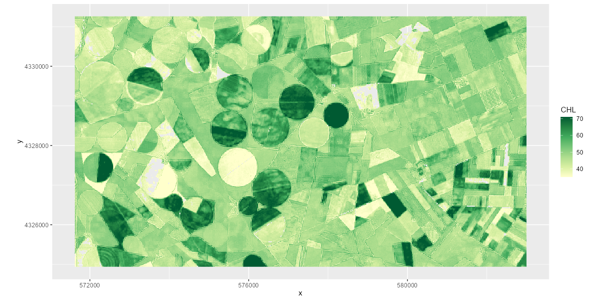
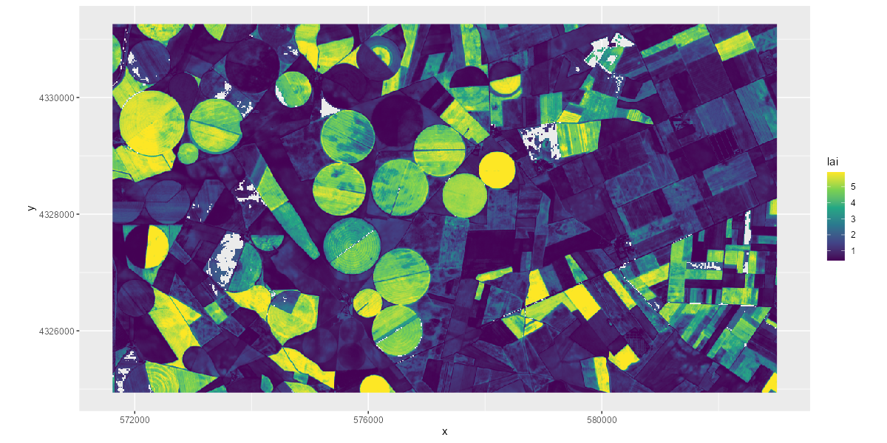
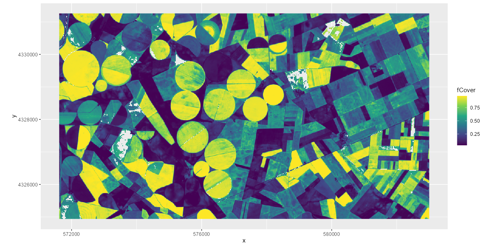

```{r setup, include = FALSE}
knitr::opts_chunk$set(
  collapse = TRUE,
  comment = "#>",
  eval=FALSE
)
```

This tutorial is based on the estimation of vegetation properties from 
Sentinel-2 data and `prosail` hybrid inversion. 
It provides the full framework step by step, including Sentinel-2 data download, 
image preprocessing and masking, hybrid model training, and the application of 
the model on an image. 


# Identifying and downloading Sentinel-2 images

The Sentinel-2 acquisition corresponds to the Barrax area in Spain. 
Barrax is a well-studied area for remote sensing applications on crop monitoring. 
A polygon corresponding to the study area can be downloaded from a repository. 

```{r identify_S2_product}
# libraries
library(preprocS2)
library(sf)
# define bounding box for area of interest
aoi_bbox <- sf::st_bbox(obj = c('xmin' = 571626, 'ymin' = 4324941, 
                                'xmax' = 582995, 'ymax' = 4331253))
aoi <- preprocS2::bbox_to_poly(aoi_bbox, crs = 32630)
```

[Sentinel-hub](https://apps.sentinel-hub.com/eo-browser/?zoom=11&lat=39.09836&lng=-2.01462&themeId=DEFAULT-THEME&visualizationUrl=https%3A%2F%2Fservices.sentinel-hub.com%2Fogc%2Fwms%2Fbd86bcc0-f318-402b-a145-015f85b9427e&datasetId=S2L2A&fromTime=2021-05-13T00%3A00%3A00.000Z&toTime=2021-05-13T23%3A59%3A59.999Z&layerId=1_TRUE_COLOR) 
is then used in order to identify an acquisition with minimum cloud cover.

Once a date of acquisition is identified, the S2 product is then downloaded. 
The R package [`preprocS2`](https://jbferet.gitlab.io/preprocs2/) is used for 
this purpose. 
`preprocS2` will download S2 data from a STAC catalog based on spatial and 
temporal information.
The default STAC collection is `sentinel-2-l2a` from the Planetary computer 
catalog.

Optionally, `preprocS2` can download the geometry of acquisition corresponding 
to the S2 acquisition by setting `geomAcq = T` and providing authentication to 
the [CDSE](https://dataspace.copernicus.eu/analyse/apis).

Authentication for CDSE should be obtained by activating an OAuth clients ID, 
following [`this link`](https://shapps.dataspace.copernicus.eu/dashboard/#/account/settings). 
Please make sure you copy the password related to your OAuth clients ID as you 
will not be able to access it once you close the page.

Access to geometry of acquisition is provided by the package 
[`CDSE`](https://zivankaraman.github.io/CDSE/).

Make sure you follow the procedure described in the 
[`preprocS2`](https://jbferet.gitlab.io/preprocs2/) installation doc 
to save credentials for CDSE and OAuth client ID in your `~/.Renviron` file. 


```{r download_S2_product}
# library
library(preprocS2)
library(sf)

# 1- define input & output directories
output_dir_s2 <- './S2_images'
dir.create(path = output_dir_s2, showWarnings = F, recursive = T)
datetime <- '2021-05-13'
# save aoi as vector file
path_aoi <- 'barrax_aoi.GPKG'
sf::st_write(obj = aoi, dsn = path_aoi, driver = 'GPKG')

# get tiling grid kml from https://sentiwiki.copernicus.eu/web/s2-products
path_S2tilinggrid <- 'Sentinel-2_tiling_grid.kml'

# 3- get S2 acquisition and geometry of acquisition for study area
list_files <- get_s2_raster(aoi_path = path_aoi, datetime = datetime, 
                            output_dir = output_dir_s2, 
                            path_S2tilinggrid = path_S2tilinggrid, 
                            siteName = 'Barrax', overwrite = FALSE, 
                            geomAcq = TRUE)
# Sentinel-2 L2A reflectance
refl_L2A <- list_files$Refl_L2A
# Sentinel-2 binary mask identifying vegetation, discarding clouds & shadows
vegetation_mask <- list_files$vegetation_mask
# Sentinel-2 mask from provider ( = SCL from ESA products)
SCL <- list_files$provider_mask
# Sentinel-2 geometry of acquisition (if requested from CDSE)
geometryAcquisition <- list_files$geometryAcquisition
```

The RGB representation of the Sentinel-2 acquisition is displayed below. 
<p>


</p>


# Training and application of hybrid inversion model 

The default parameterization for the distribution of input PROSAIL parameters 
applied to simulate a training dataset follows the distribution described in the 
[ATBD document](https://step.esa.int/docs/extra/ATBD_S2ToolBox_V2.0.pdf)

However, PROSAIL inversion can be fully parameterized, in order to adapt the 
distribution of input parameters, geometry of acquisition, soil parameters, 
spectral bands to be used, noise level... 

See [previous tutorial](https://jbferet.gitlab.io/prosail/articles/prosail3.html) 
for detailed procedure. 

The package [`bigRaster`](https://gitlab.com/jbferet/bigRaster) can be used to 
handle inversion over large rasters if needed, but may be more time consuming 
over smaller raster data. 

```{r Hybrid_Inversion}
library(prosail)
output_dir_BP <- './PROSAIL'
# get sensor response for Sentinel-2
sensor_name <- 'Sentinel_2'
srf <- get_radiometry(sensor_name)

# define parameters to estimate
parms_to_estimate <- c('lai', 'chl', 'ewt', 'lma', 'fcover', 'fapar', 'albedo')

# define spectral bands required to train SVR model for each variable
selected_bands <- list('lai' = c('B3','B4','B8'), 
                       'fcover' = c('B3','B4','B8'), 
                       'fapar' = c('B3','B4','B8'), 
                       'chl' = c('B3','B4','B5','B6','B7','B8'), 
                       'ewt' = c('B8A','B11','B12'), 
                       'lma' = c('B8A','B11','B12'))

# get S2 geometry from preprocS2
angles_path <- preprocS2::get_s2_angles(path_angles = geometryAcquisition[[datetime]], 
                                        path_bbox = path_aoi)
# define ranges for zenith angles of acquisition
geom_acq <- list('min' = data.frame('tto' = angles_path$MinAngle['vza'],
                                   'tts' = angles_path$MinAngle['sza'], 
                                   'psi' = angles_path$MinAngle['psi']), 
                'max' = data.frame('tto' = angles_path$MaxAngle['vza'], 
                                   'tts' = angles_path$MaxAngle['sza'], 
                                   'psi' = angles_path$MaxAngle['psi']))

# users can define geom_acq following their own conditions by following the list 
# structure above if preprocS2 is not applied to get imagery

# train regression model
# set method = 'svmRadial' or method = 'svmLinear' to use SVR implemented in 
# the R package caret instead of liquidSVM
modelSVR <- train_prosail_inversion(parms_to_estimate = parms_to_estimate,
                                    atbd = TRUE, geom_acq = geom_acq, srf = srf, 
                                    selected_bands = selected_bands, 
                                    output_dir = output_dir_BP, 
                                    method = 'liquidSVM')

# apply regression model on Sentinel-2 raster data
# S2 imagery is provided with reflectance defined as integer between 0 and 10000
# Adapt multiplying_factor if not the case 
# multiplying_factor = 1 if reflectance defined between 0 and 1
BPvars <- apply_prosail_inversion(raster_path = refl_L2A, 
                                  hybrid_model = modelSVR, 
                                  output_path = PROSAIL_ResPath,
                                  selected_bands = selected_bands, 
                                  bandname = srf$spectral_bands, 
                                  mask_path = vegetation_mask, 
                                  multiplying_factor = 10000)
```


Assessed biophysical properties computed with `apply_prosail_inversion` are then 
saved as individual raster files. 
For each biophysical variable, the mean value and standard deviation defined by 
the input variable `nb_models` from `modelSVR` (default = 20 models) is saved.

The biophysical variables `chl`, `lai`, `fapar` and `fcover` are displayed 
below:

<p float="left">
  
  
</p>
<p float="left">
  
  
</p>


# Comparison with SNAP outputs 

The LAI, fAPAR and fCover are compared with the values produced with the 
Biophysical Processor of the SNAP toolbox over the same acquisition
The comparison is diplayed in the figure below. 
It shows that the two implementations provides consistent estimation for these 
variables when following the ATBD sampling strategy for the training samples, 
despite the differences in terms of machine learning algorithm. 

<p>


</p>
