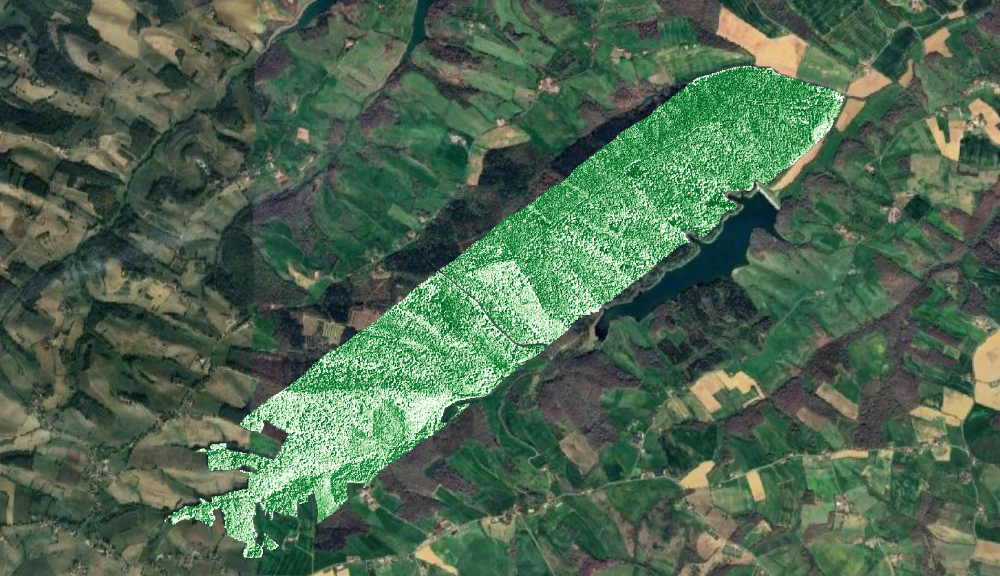
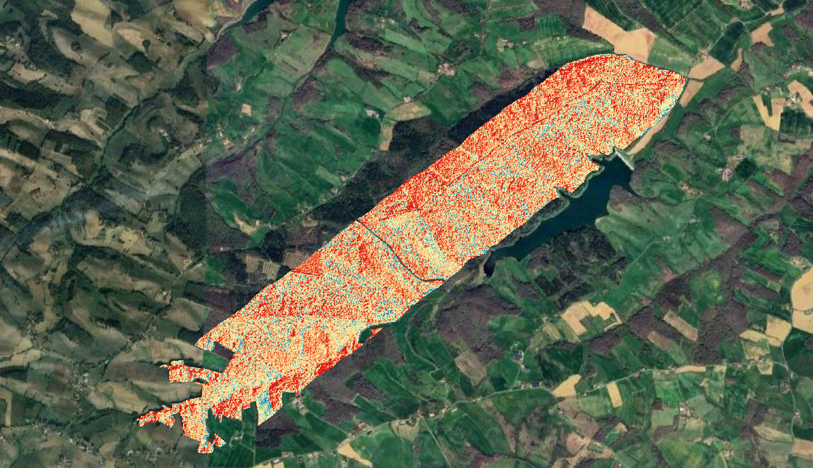
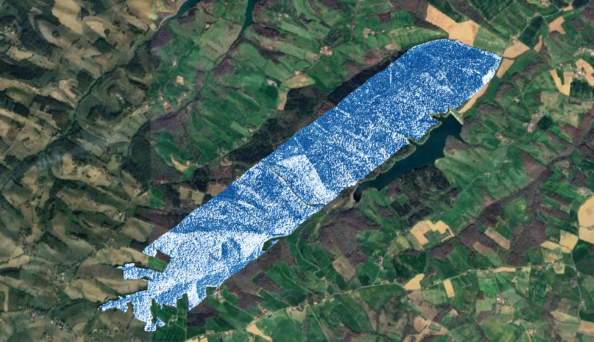
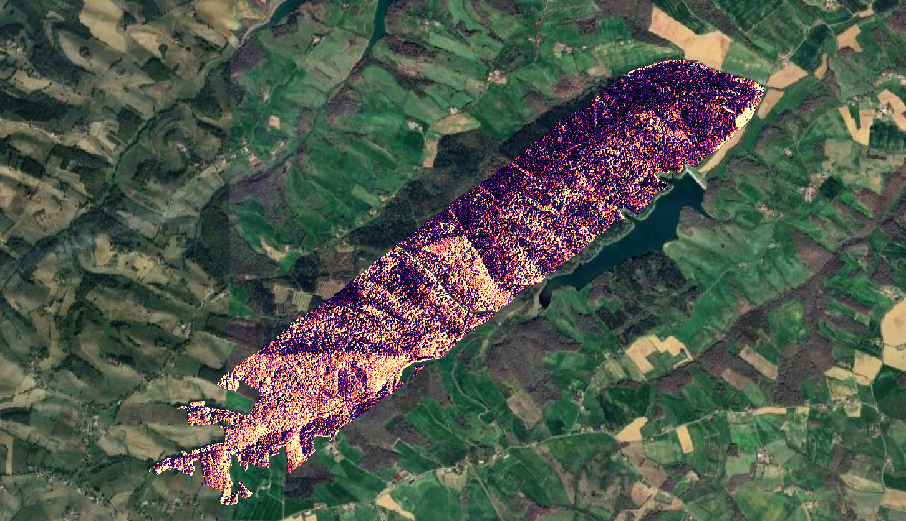

```{r setup, include = FALSE}
knitr::opts_chunk$set(
  collapse = TRUE,
  comment = "#>",
  eval=FALSE
)
```

This tutorial will guide you through the application of `prosail` in order to 
produce biophysical properties from hybrid inversion.

## download imaging spectroscopy data required for the tutorial

The image can be downloaded from [this webpage](https://doi.org/10.57745/SDPRYY).
Three files are available on the webpage:

- `Readme_FAbas_HS_mosaic-2.pdf`

- `Fabas_HS_mosaic.hdr`: header file for the image data, contains all metadata 
such as central wavelengths of the different bands, image size, projection...

- `Fabas_HS_mosaic.tif`: the binary image. This is a surface reflectance image, 
which is geometrically and atmospherically corrected. 
Image spatial resolution is 4m. a multiplying factor of 10000 was applied on 
reflectance (10000 = 100% reflectance).

The data should be placed in a directory defined as `data_dir` in the next code 
chunk.


## define input / output directories

The input data directory is defined, as well as the directory where vegetation
biophysical parameters obtained from `prosail` hybrid inversion. 
This tutorial uses functions performing raster tiling when processing `prosail` 
hybrid inversion, hence the definition of a subdirectory named `tiles`.

```{r, eval=FALSE}
# clean workspace
rm(list = ls(all=TRUE)); gc()
if (rstudioapi::isAvailable()) 
  setwd(dirname(rstudioapi::getSourceEditorContext()$path))
library(prosail)

# 1.1- define input & output directories
data_dir <- './01_DATA'
prosail_dir <- './03_RESULTS/prosail_inversion'
prosail_tiles <- file.path(prosail_dir, 'tiles')
dir.create(prosail_tiles, showWarnings = F, recursive = T)
```

## prepare imaging spectroscopy data for processing: spectral/spatial masking

### get metadata and additional information

Identify the imaging spectroscopy raster, and get metadata from the header file. 
The central wavelength and full width at half maximum (FHWM) are needed to 
produce a spectral response function which will then be needed to simulate
surface reflectance with sensor response. 

```{r, eval=FALSE}
# 1.2- define input & output directories
input_raster_path <- file.path(data_dir,'Fabas_HS_mosaic.tif')

# get information on wavelength and fwhm from header
hdr <- read_envi_header(hdr_path = get_hdr_name(image_path = input_raster_path))
sensor_bands <- hdr$wavelength
sensor_fwhm <- hdr$fwhm
```


### filter out shaded, non vegetated, and hazy pixels. 

A basic filtering process can be applied in order to mask irrelevant pixels 
(no vegetation) and pixels with poor quality (hazy/cloudy or shaded areas).
The function `radiometric_filtering` implemented in the package 
[`biodivMapR`](https://jbferet.github.io/biodivMapR/index.html) performs a 
filtering combining multiple criteria. 

- non vegetated pixels are filtered out with a NDVI thresholding: all pixels with 
`NDVI < NDVI_Thresh` are masked.

- hazy / cloudy pixels are filtered out with a Blue band thresholding: all pixels
with `R\text{blue} > Blue_Thresh` are masked.

- shaded pixels are filtered out with a near infrared band thresholding: all 
pixels with `R\text{nir} < NIR_Thresh` are masked.


```{r, eval=FALSE}
##  1.3- spatial filtering: discard with hazy/cloudy, shaded & no vegetation
library(biodivMapR)
NDVI_Thresh <- 0.5
Blue_Thresh <- 600
NIR_Thresh <- 1500
mask_path <- radiometric_filtering(input_raster_path = input_raster_path, 
                                   input_rast_wl = sensor_bands,
                                   output_dir = prosail_dir, 
                                   NDVI_Thresh = NDVI_Thresh, 
                                   Blue_Thresh = Blue_Thresh, 
                                   NIR_Thresh = NIR_Thresh)
```

If no mask available, then `mask_path` should not be specified as input for
`apply_prosail_inversion`.

### filter out spectral bands with low signal to noise ratio (SNR)

Additional information corresponding to atmospheric transmittance are also 
downloaded in order to perform spectral filtering for low transmittance. 
Low SNR is **arbitrarily** defined as a threshold of 0.85. 
Please investigate how to filter out spectral domains with low SNR on your own 
imaging spectroscopy data as it may depend on sensor, conditions of acquisitions, 
and other factors. 
An additional band showing strong noise after careful analysis is also discarded. 


```{r, eval=FALSE}
# 1.4- spectral filtering
# atmospheric transmittance file available on a repository
git_repository <- 
  'https://gitlab.com/jbferet/myshareddata/-/raw/master/Fabas_HS_AtmoT'
git_file <- 'AtmoT_Fabas_Hyspex.csv'
url <- file.path(git_repository, git_file)
path_atmo <- file.path(data_dir,git_file)
download.file(url = url, destfile = path_atmo)

# spectral filtering #1: discard bands with transmission factor<0.85
transmittance <- read.delim(path_atmo, header = TRUE)
low_trans <- which(transmittance$Transmittance<0.85)
# spectral filtering #2: discard noisy band remaining
noise <- which((sensor_bands > 2200 & sensor_bands < 2205))
# combine bands to discard
wl_elim <- c(low_trans, noise)

```


## perform hybrid inversion of `prosail` on imaging spectroscopy data

The hybrid inversion implemented in the `prosail` package is a bagging 
prediction of biophysical properties: a LUT is simulated with prosail and 
resampled in order to produce multiple datasets including a limited number of 
samples. 
Then a set of individual support vector regression (SVR) models is trained from 
each reduced dataset.

The hybrid inversion consists in two main stages for users: 

- training of a machine learning regression model (SVR) for each biophysical 
property of interest based on surface reflectance factor LUT simulated with 
PROSAIL

- application of the SVR models to a dataset provided as a matrix or as a raster


### preparation for a training dataset

The hybrid inversion can be easily parameterized to adapt to any type of sensor, 
input parameter distribution, type of noise. 

alternative machine learning (ML) methods will be implemented in the future, and 
suggestions are welcome for the implementation of alternative algorithms.
Let's go. 

#### biophysical variables of interest

`prosail` takes into account the influence of multiple biophysical properties. 
Each input parameter can be theoretically estimated through hybrid inversion. 
However, the relevance and uncertainty associated with these estimates 
strongly depends on i) the type of sensor (spectral information provided), 
ii) the signal to noise ratio of the data, and iii) the type of vegetation 
(keeping in mind that `prosail` is based on a turbid hypothesis, hence, not 
appropriate for heterogeneous forests).


Here, we will estimate four biophysical properties which will then be used to 
compute spectral diversity. 
These are: 
- leaf area index (`lai`)
- leaf chlorophyll content (`chl`)
- equivalent water thickness (`ewt`)
- leaf mass per area  (`lma`)

```{r, eval=FALSE}
# biophysical variables to estimate
parms_to_estimate <- c('lai', 'chl', 'ewt', 'lma')
```

#### spectral domain of inversion

The accuracy of the estimation of vegetation biophysical properties from 
remotely sensed data varies with the spectral information provided to the ML
algorithm. 
Here, we arbitrarily define spectral domains for each biophysical property of 
interest. 
Spectral feature selection may be used in order to refine the optimal spectral 
domain for each property.
Noise level to be applied on simulated data is also defined for each property. 


```{r, eval=FALSE}
# spectral domain used for estimation of each variable, discard wl_elim
selected_bands <- noise_level <- list()
wl_train <- data.frame(min = c('lai'=700, 'chl'=700, 'ewt'=1200, 'lma'=1200),
                       max = c('lai'=900, 'chl'=900, 'ewt'=2400, 'lma'=2400))
for (parm in parms_to_estimate) {
  bandsel <- which(sensor_bands > wl_train[parm, 'min'] & 
                     sensor_bands < wl_train[parm, 'max'])
  selected_bands[[parm]] <- sensor_bands[bandsel[-na.exclude(match(wl_elim, bandsel))]]
  # 2% relative gaussian noise applied to reflectance data
  noise_level[[parm]] <- 0.02        
}
```


#### geometry of acquisition

A rough estimate of the valid range for the geometry of acquisition 
should be provided, ideally. 

- observer zenith angle `tto`

- sun zenith angle `tts`

- relative azimuth angle `psi`

```{r, eval=FALSE}
# define geometry of acquisition based on location and time of acquisition
geom_acq <- data.frame(min = c('tto' = 0, 'tts' = 50, 'psi' = 0), 
                       max = c('tto' = 15, 'tts' = 70, 'psi' = 360))

```

#### input parameter distribution

Users can define distribution and range for each input parameter of `prospect`. 
However, for the sake of straightforwardness, the parameterization defined in 
the [Algorithm Theoretical Based Document](https://step.esa.int/docs/extra/ATBD_S2ToolBox_V2.1.pdf) 
(ATBD) of the Sentinel-2 toolbox will be used here.


```{r, eval=FALSE}
# use same distribution as used in ATBD for Sentinel-2 data
input_prosail <- get_input_prosail(atbd = TRUE, geom_acq = geom_acq)
# waiting for updated soil database, deactivate soil v3 
input_prosail$soil_brightness <- input_prosail$soil_ID  <- NULL
```


#### spectral response function

The spectral response function (SRF) needs to be defined in order to simulate sensor 
reflectance. 

The SRF of several sensors is already implemented in `prosail`: Sentinel-2, 
Landsat-7, Landsat-8, Landsat-9, SPOT 6/7, MODIS, Pleiades, and Venus. 

Here, the SRF of the hyperspectral sensor is produced from central wavelengths 
and FWHM based on a gaussian response model. 


```{r, eval=FALSE}
# get sensor response function corresponding to the sensor
sensor_name <- 'Hyspex'
srf <- get_srf_sensor(sensor_name = sensor_name, 
                      wl = sensor_bands, 
                      fwhm = sensor_fwhm)
```


### train ML regression algorithms with simulated data

The function `train_prosail_inversion` performs the training of the ML algorithm 
based on the information generated in the previous steps. 
It provides a set of regression models for each biophysical property to estimate. 

```{r, eval=FALSE}
message('training ML regression with prosail simulations')
options <- set_options_prosail(fun = 'train_prosail_inversion')
options$noise_level <- noise_level
hybrid_model <- train_prosail_inversion(input_prosail = input_prosail, 
                                        parms_to_estimate = parms_to_estimate,
                                        geom_acq = geom_acq, 
                                        srf = srf,
                                        selected_bands = selected_bands,
                                        output_dir = prosail_dir, 
                                        options = options)
```

### apply ML regression algorithms on images

The function `apply_prosail_inversion` applies ML regression trained at the 
previous step on raster data. 
As for [spectral indices](https://jbferet.gitlab.io/tutorial_puertorico2025/compute-spectral-indices-from-sentinel-2-image.html#computing-spectral-indices-from-sentinel-2-raster), a grid is first defined 
on the aoi. 
Model inversion is then applied individually for each tile. 
The current version of prosail does not support multiprocessing for the 
application of ML algorithm, but suggestions are welcome for its implementation. 


```{r, eval=FALSE}
# apply models on image
message('applying ML regression on image')
options <- set_options_prosail(fun = 'apply_prosail_inversion_per_tile')
options$tiling <- TRUE      # process image per square tile
options$tile_size <- 1000   # dimensions of individual square tile (in meters)
BPvars <- apply_prosail_inversion(raster_path = input_raster_path, 
                                  mask_path = mask_path, 
                                  output_dir = prosail_tiles,
                                  hybrid_model = hybrid_model, 
                                  band_names = sensor_bands,
                                  selected_bands = selected_bands, 
                                  options = options)
```

### resulting biophysical properties

The maps corresponding to the biophysical variables estimated from imaging 
spectroscopy data are displayed below. 

<p float="left">
  
  
</p>
<p float="left">
  
  
</p>
  Fig. 1. Estimation of `chl`, `lai`, `ewt`, `lma` from a the inversion of 
  prosail applied to the imaging spectroscopy raster acquired over the Fabas 
  forest.
